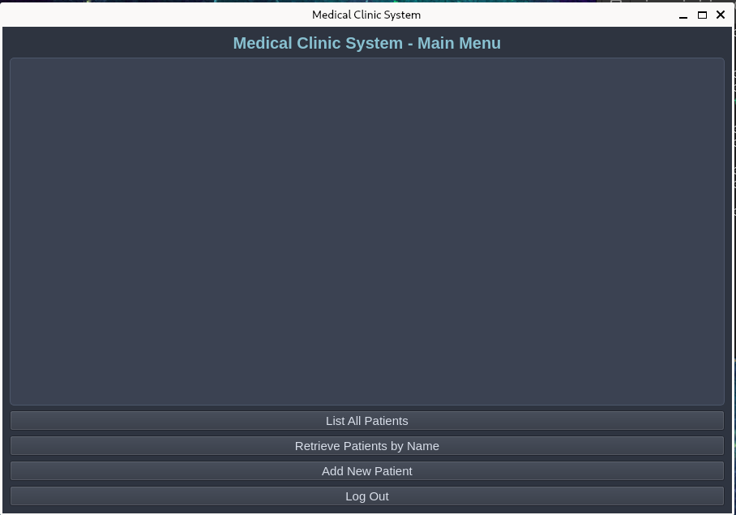

<h1>Medical Clinic System</h1>


<h2>Description</h2>
This project is a Python-based Medical Clinic Management System designed to streamline patient and record management in a medical clinic. It was developed in three phases, progressing from a memory-based system to a persistent storage model, and finally incorporating a user-friendly graphical interface.

Initially, the system implemented core functionalities such as login/logout, patient and note CRUD operations, and patient record management. The model was built with modularity in mind, ensuring clear responsibilities across the Controller, Patient, PatientRecord, and Note classes, and passing rigorous integration tests.

In the second phase, data persistence was introduced using JSON for patient data and Pickle for patient records. The project adopted a Data Access Object (DAO) design pattern, preparing the system for future scalability with databases. Autosave functionality was added to maintain consistency, and custom exception handling improved reliability.

The final phase introduced a GUI developed with PyQt6. The GUI adheres to the Model-View-Controller (MVC) pattern, ensuring separation of concerns. It features intuitive components like QTableView for patient lists and QPlainTextEdit for notes, providing a seamless user experience.

This project demonstrates modular programming, robust testing, and effective design patterns, making it a reliable and extensible system for managing clinic operations.
<br />


<h2>Languages and Utilities Used</h2>

- <b>Python 3</b> 
- <b>PyQt6</b>

<h2>Environments Used </h2>

- <b>Linux</b>
- <b>Git</b> 

<h2>GUI walk-through:</h2>

<p align="center">
Main Menu: <br/>
#

 
<br />

<br />
<br />
Select the disk:  <br/>

<br />


<!--
 ```diff
- text in red
+ text in green
! text in orange
# text in gray
@@ text in purple (and bold)@@
```
--!>
